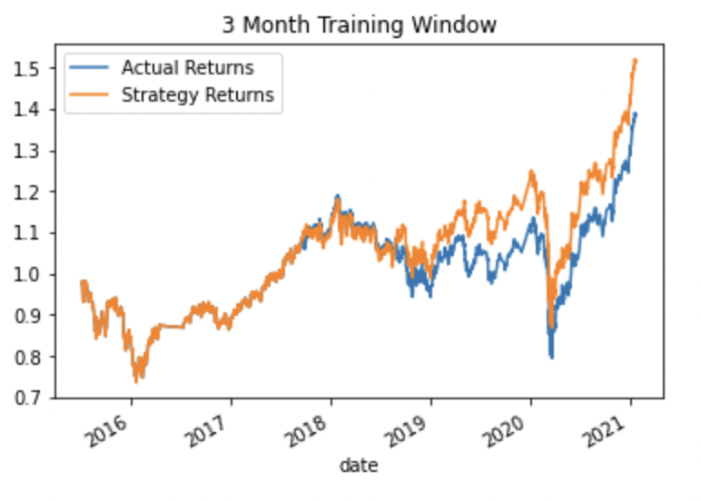
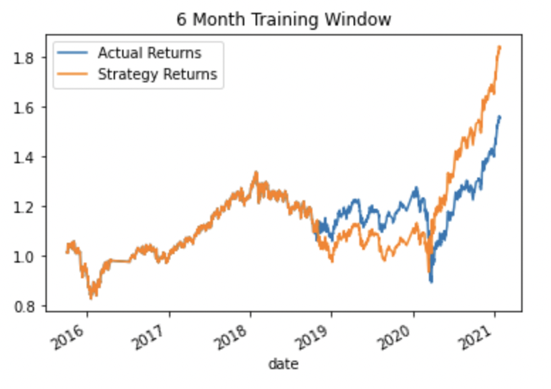
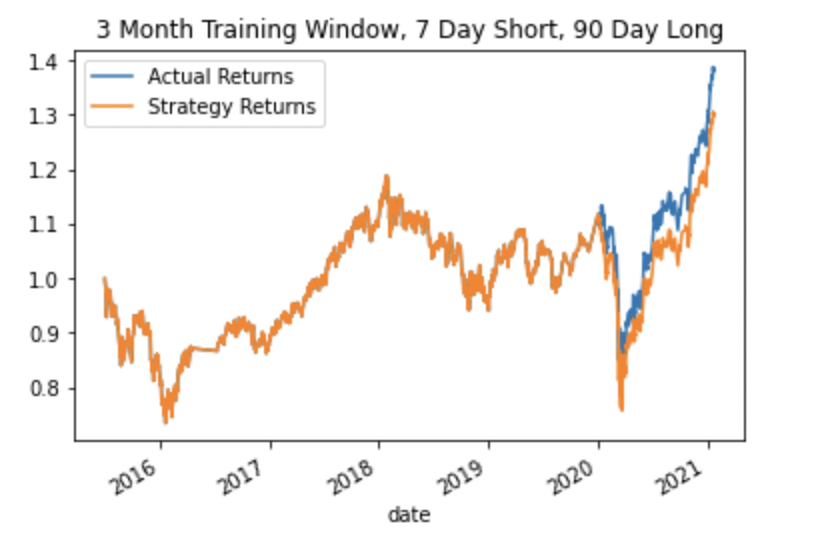
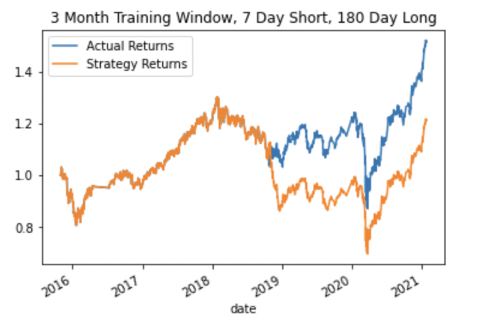

# Algorithmic Trading
## Trading Bots & Trading Signals

This notebook helps enhance existing trading signals with machine learning algorithms that can adapt to new data. With that being said we will create an algorithmic trading bot that learns and adapts to new data and evolving markets by implementing an algorithmic trading strategy that uses machine learning to automate the trade decisions, adjust the input parameters to optimize the trading algorithm, and train a new machine learning model and compare its performance to that of a baseline model.

---

## Technologies

This project uses a Jupyter Notebook in Jupyter Lab with the following libraries:

- Pandas: to help with the robust amount of features that will help analyze and organize the data.
- sklearn: for importing the train_test_split to split and train the data for the model, StandardScaler to scale the data, LogisticRegression to create a second model, classification_report to view the metrics of the model and view it's accuracy, svm to use SVC classifier model to fit the training data and make predictions based on the testing data
- hvplot: to plot and visualize the actual returns against the strategy returns. 
- Path: to read the data from the CSV file.
- numpy: to convert certain datasets to numpy arrays so that the model will run with no issue.

---

## Usage

To succesfully run this notebook, please be sure to import the required libraries and dependencies:

```
import pandas as pd
import numpy as np
from pathlib import Path
import hvplot.pandas
import matplotlib.pyplot as plt
from sklearn import svm
from sklearn.preprocessing import StandardScaler
from pandas.tseries.offsets import DateOffset
from sklearn.metrics import classification_report
from sklearn.linear_model import LogisticRegression
```



_Original Version_


---


## Conclusion

After tweaking some of the model's inputs to try to achieve better trading outcomes, I have come to the following conclusions:  

1) I increased the training window to 6 months and this seems to have increased the Actual Returns and Strategy Returns, however the gap between actual and strategy returns did become larger. Increasing the training window to 6 months did increase both returns. 




2) I returned the training window to 3 months and adjusted the Short Window to 7 days and the Long Window to 90 days. This brought the Actual and Strategy returns closer to each other, and actually helped the actual returns exceed the strategy returns. 




3) With the training window still at 3 months, I then changed the long window to 180 days and noticed that gap between the actual and strategy returns grew larger. The actual returns exceeded the strategy returns by a far greater amound and was higher than the actual returns for the 90 day long window. 




4) Evaluationg a New Machine Learning Classifier - I decided to use the Linear Model and Logistic Regression Model. When using this model and the original data, the model's accuracy decreased 3% points from 55% to 52%. The Actual returns increased slightly and the actual and strategy returns crossed over each other, with the actual returns on an upward trend and the strategy returns on a downward trend. 


---

## Contributors

Michael Husary was the main contributer along with fellow classmates and the educational staff. 

--- 

## License
*(Not sure if a license was required on this Challenge)*


MIT
